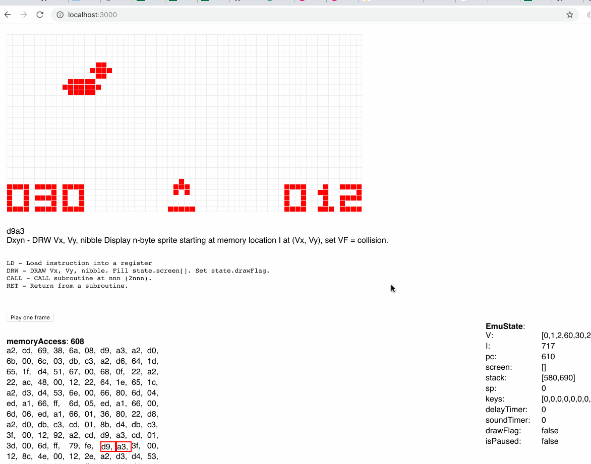

This is an emulator for Chip-8 systems written in JS / React and runs in your browser. I wrote this for a talk at Framework summit (TODO add slides, youtube
link). That means you can play pong, Space Invaders etc.

Run in locally with
`$ yarn start`

The code for the emulator itself works fine. The hooks for all the debugging
tools are total hacks. It should be removed (inclding the proxies etc). 

The most useful resources for building the emulator were:  
- http://blog.alexanderdickson.com/javascript-chip-8-emulator
- https://github.com/alexanderdickson/Chip-8-Emulator
- http://www.multigesture.net/articles/how-to-write-an-emulator-chip-8-interpreter/
- https://en.wikipedia.org/wiki/CHIP-8
- http://devernay.free.fr/hacks/chip8/C8TECH10.HTM
- http://mattmik.com/files/chip8/mastering/chip8.html (runs a bitcoin miner, so
I'd save the file locally to stop your CPU from spiking)

This project was bootstrapped with [Create React App](https://github.com/facebookincubator/create-react-app).

